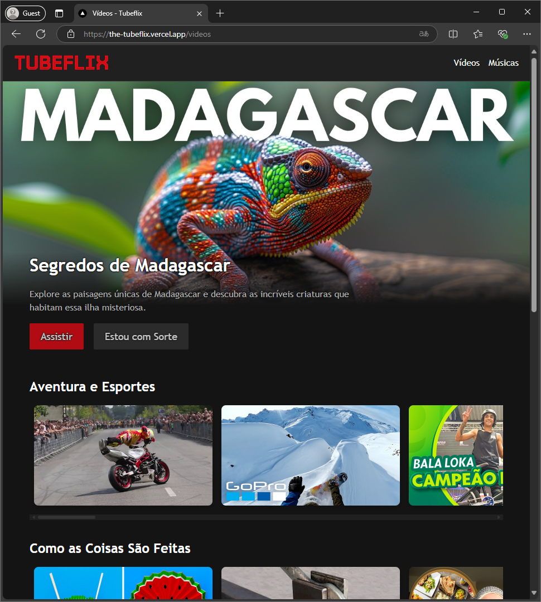

# Tubeflix

https://the-tubeflix.vercel.app/



## Descrição

Este é um aplicativo desenvolvido em **Next.js**, com o objetivo de demonstrar a maneira moderna e sugerida para criar aplicações React utilizando um framework. O projeto passou pelos conceitos essenciais do Next.js, como:

- **App Router** (abordagem moderna para estruturação de rotas)
- Utilização do **Turbopack** embutido no Next.js (sem a necessidade de Webpack ou Babel)
- Renderização eficiente e organização otimizada de componentes.
- ...

## Funcionalidade

O aplicativo possui um layout similar ao **Netflix**, mas exibe vídeos do **YouTube**, que são reproduzidos diretamente na interface por meio de embeds do YouTube. 

- A lista de vídeos exibidos no app pode ser facilmente modificada no arquivo: `./src/data/videos.json`

## Pré-requisitos

Certifique-se de ter o **Node.js** e o **npm** instalados na sua máquina.

## Comandos para execução

1. Instale as dependências do projeto:
 ```
 npm install
 ```

2. Inicie o servidor de desenvolvimento:
 ```
 npm run dev
 ```

3. Para criar um build de produção:
 ```
 npm run build
 ```

4. Para executar o servidor em produção após o build:
 ```
 npm start
 ```

## Estrutura do Projeto

- **`app/`**: Organização de rotas usando a abordagem App Router.
- **`components/`**: Componentes que montam o layout da aplicação.
- **`src/data/videos.json`**: Arquivo onde a lista de vídeos é configurada.
- **`public/`**: Recursos estáticos como imagens.

Desenvolvido para ensinar como criar aplicações modernas utilizando Next.js e seus recursos mais recentes!

| [](https://github.com/sergiocabral) |
| :-: |
|[sergiocabral.dev](https://sergiocabral.dev)|
